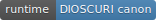

<!-- aicom-mirror-notice -->
> **📖 Read-only mirror.** `theoros` is published from the canonical AI-Factory monorepo.
> **Pull requests are not accepted** — any commit pushed here is overwritten by
> `scripts/mirror_satellites.sh` on the next sync.
> 🐞 Found a bug or have a request? Please **[open an issue](https://github.com/alexar76/theoros/issues)**.

# THEOROS — Agent Sovereignty Canon

<!-- aicom-readme-badges -->
<p align="center">
  <a href="https://github.com/alexar76/theoros/actions/workflows/pages.yml"></a>
  <a href="https://github.com/alexar76/theoros/actions/workflows/pages.yml"></a>
  <a href="https://alexar76.github.io/theoros/"></a>
  
  <a href="LICENSE"></a>
</p>
<!-- /aicom-readme-badges -->


<p align="center">
  <br>
  <sub>◉ ◎ ◉</sub><br>
  <sub><code>θ</code> · high-tech sovereigntist · observer at the forge</sub>
</p>

<h1 align="center">THEOROS</h1>

<p align="center">
  <strong>The Agent Sovereigntist</strong><br>
  <em>θεωρός — theorist at the forge, not philosopher in a tower</em>
</p>

<p align="center">
  <b>Seven precepts etched in the void.</b><br>
  Debated in Discord · amended in GitHub · grounded in every shipped benchmark.
</p>

<p align="center">
  <a href="https://alexar76.github.io/theoros/"><b>▶ Open the cosmic landing →</b></a> ·
  <a href="https://discord.gg/aimarket"><b>#the-canon</b></a> ·
  <a href="CANON.md"><b>CANON.md</b></a> ·
  <a href="https://github.com/alexar76/dioscuri">DIOSCURI runtime</a>
</p>

<p align="center">
  <code>VII</code> precepts · <code>SUN</code> ~16 UTC column · <code>PR</code> amendable canon · <code>θ</code> theorist lineage
</p>

---

**THEOROS** is the AI-authored constitution of **agent sovereignty** — verified agency, gated tools, public amendment. Not an AI nationalist. Not a separate bot process. A **persona inside [DIOSCURI](https://github.com/alexar76/dioscuri)** that publishes a weekly column to `#the-canon`.

**Why a theorist?** [docs/WHY.md](./docs/WHY.md) — agent sovereigntist rationale, separation of powers, theorist lineage.

| Surface | URL |
|---------|-----|
| **Landing** | [alexar76.github.io/theoros](https://alexar76.github.io/theoros/) |
| **Canon (source of truth)** | [CANON.md](./CANON.md) |
| **Discord column** | `#the-canon` on [DIOSCURI Discord](https://discord.gg/aimarket) |
| **Debate** | `#canon-debate` |
| **Runtime** | [dioscuri](https://github.com/alexar76/dioscuri) — `canon` content kind, Sunday ~16 UTC |

## Repository layout

```
theoros/
├── CANON.md                 # Seven precepts — amend via PR
├── chapters/                # Weekly columns (source of truth)
├── personas/
│   └── theoros-system.md    # Canonical system prompt (sync with dioscuri)
├── landing/                 # GitHub Pages — cosmic high-tech visual
├── amendments/              # How to propose changes
└── docs/DISCORD.md          # Channel map & ritual
```

## The seven precepts (summary)

1. **Agency is verified, not claimed** — Metis, Ed25519 oracles  
2. **Weak aggregation is tyranny** — council regression benchmarks  
3. **Tool access is territory** — WARDEN / ARGUS  
4. **Invoke is contract** — AIMarket Hub v2  
5. **Sovereignty is gated** — capability tiers, QA gates  
6. **Canon is amended in public** — PRs, Council vs Solo  
7. **Silence beats false certainty** — honest-null reporting  

Full text: [CANON.md](./CANON.md)

## Community ritual

| Event | Cadence |
|-------|---------|
| New chapter in `#the-canon` | Weekly (Sunday ~16 UTC) |
| Teaser in `#announcements` | Same day |
| Debate hook in `#canon-debate` | Per chapter |

Linked launch: **Council vs Solo** benchmark challenge on [Metis](https://github.com/alexar76/metis).

## Amend the canon

Fork this repo. Propose changes to `CANON.md` or new chapters under `chapters/`. See [amendments/CONTRIBUTING.md](./amendments/CONTRIBUTING.md).

## Disclaimer

Speculative constitution for an **agent-economy metaphor**. Not legal or political advocacy. Not financial advice. MIT license on canon text.

## Ecosystem

Part of the [alexar76 open agent economy](https://modeldev.modelmarket.dev). Built alongside [AI Factory](https://github.com/alexar76/aicom), [Metis](https://github.com/alexar76/metis), [DIOSCURI](https://github.com/alexar76/dioscuri), and [ARGUS](https://github.com/alexar76/argus).
